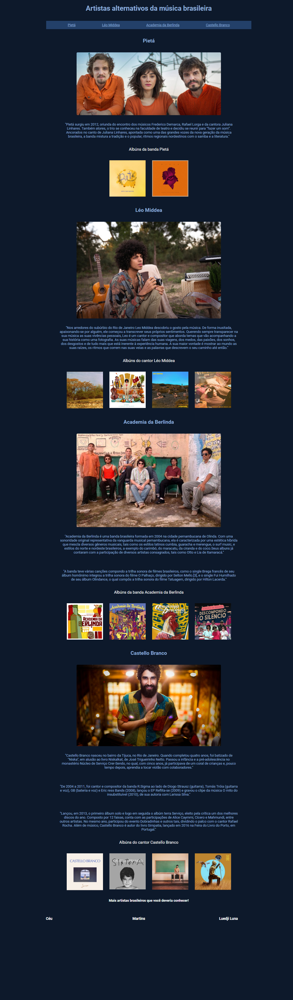

# 📋 Indíce

- [Bem-vindo](#id01)
- [Proposta](#id02)
  - [O desafio](#id02.1)
  - [Objetivo](#id02.2)
- [Meu processo](#id03)
  - [Construção do site](#id03.1)
  - [Aprendizado](#id03.2)
  - [Prosseguimento](#id03.3)
- [Screenshots](#id04)
- [Links](#id05)
- [Tecnologias utilizadas](#id06)
- [Pré-requisitos](#id07)
- [Procedimentos de instalação](#id08)
- [Agradecimentos](#id09)
- [Autora](#id010)

# Bem-vindo! 👋 <a name="id01"></a>

**Site Música Alternativa.**

Criação de um site que busca mostrar o cenário alternativo da música brasileira e a importância que isso traz para a nossa cultura. No meio da preferência que existe das gravadoras por sons e letras comerciais, existem artistas independentes que fazem a música acontecer com as próprias mãos, com estilo próprio, talento e autenticidade.

# 🚀 Proposta <a name="id02"></a>

Prática de projetos com o objetivo de adquirir habilidades de codificação.

Escolha de um projeto com o prazo de entrega.

<br />

Data inicial: 03/09/2022

Data final: 11/09/2022

<br />

## :trophy: O desafio <a name="id02.1"></a>

<br />

Os usuários devem ser capazes de: 

- Clicar nos links de navegação principal denominados "Pietá", "Léo Middea", "Academia da Berlinda" e "Castello Branco", e serem direcionados para as respectivas sessões no site.  

- Clicar na capa dos albúns dos artistas/bandas e serem direcionados os respectivos albúns na página do spotify. 

- Assistir aos vídeos do youtube dos artistas brasileiros. 

- Abrir o site na versão desktop.  

- Abrir o site na versão mobile.


<br />

## :trophy: Objetivo <a name="id02.2"></a>

<br />

- Fazer um projeto pessoal para testar habilidades adquiridas ao longo dos estudos de 2 meses nas linguagens de marcação HTML5 e CSS3. 

- Criar um site que fala sobre artistas independentes da música alternativa brasileira.

- Criar um site responsivo.

<br />

# 👩🚀 Meu processo <a name="id03"></a>

<br />

9 dias para concluir o projeto

## :trophy: Construção do site <a name="id03.1"></a>

- Marcação HTML5 semântica
- Propriedades CSS
- Versão desktop 
- Versão mobile

**Construção:**

1. Criação do arquivo `index.html` e do `style.css`. 

2. Criação de `header`, `section`, `main` e `divs`.

3. Uma lista `ul` `li` `a` de navegação principal `nav` de redirecionamento para a sessão `section` e para os identificadores.

4. Criação do arquivo `style.mobile.css` 

Dentro da pasta `/design` terá os designs do projeto. 
O desenho ficará em formato PNG estático. Usarei meu julgamento para estilos como `font-size`, `padding`e `margin`.

## :trophy: Aprendizado <a name="id03.2"></a>

- Reforcei meu entendimento sobre listas não ordenadas 
- Melhorei a organização do código no html no que diz respeito a utilização de `header` e `main`
- Aprendi a fazer um site responsivo, onde o tamanho da página se adequa a versão mobile. 

## :trophy: Prosseguimento <a name="id03.3"></a>

Criar mais projetos pensando em consolidar conhecimentos em responsividade, para que sejam adequados com telas de celulares e tablets e que se adapte a qualquer ferramenta que os usuários estejam usando para facilitar a sua visualização.

<br />

# :camera_flash: Screenshots <a name="id04"></a>

<br />

## :desktop_computer: Desktop design



## :iphone: Mobile design


<br />

# :heavy_check_mark: Links <a name="id05"></a>

<br />

- Clique no link para acessar a página: https://rococo-lily-8747d5.netlify.app/

<br />

# 🛠 Tecnologias utilizadas <a name="id06"></a>

<br />

- HTML5
- CSS3

<br />

# ☑️ Pré-requisitos <a name="id07"></a>

<br />

- [x] Editor de código de sua preferência (recomendado VS code)
- [x] Git

<br />

# 📝 Procedimentos de instalação <a name="id08"></a>

<br />

Clone este repositório usando o comando:

```bash
git clone https://github.com/RaizaCirne/site-musica-alternativa.git
```


Baixar arquivo zip 

Extrir arquivos

Abrir pasta no editor de código.

<br />

# :sunglasses: Agradecimentos <a name="id09"></a>

<br />

Agradeço aos tutores do Time CoDe (em especial ao Jean Meira) que me ajudaram com os feedbacks em projetos anteriores e fez com que eu pudesse melhorar em alguns aspectos. 

Agradeço também a Ana Carolina Perdigão que tirou diversas dúvidas e me ajudou demais com este projeto.

<br />

# :sunglasses: Autora <a name="id010"></a>

<br />

- Personal Page - [Raíza Cirne Braz](https://rococo-lily-8747d5.netlify.app/)
- Frontend Mentor - [@RaizaCirne](https://www.frontendmentor.io/profile/RaizaCirne)
- GitHub - [RaizaCirne](https://github.com/RaizaCirne)
- LinkedIn - [Raíza Cirne Braz](https://www.linkedin.com/in/ra%C3%ADzacirne/)

**HTML - CSS** 🚀
